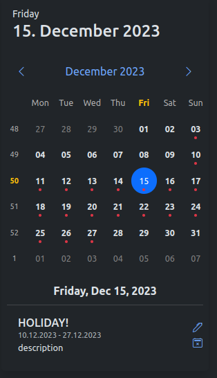

# jquery-bs-calendar
  
The event calendar was created with JQuery and Boostrap 5. It does not need any additional CSS file.  
The calendar can be included in all Boostrap elements (.card, .navbar, .offcanvas, .dropdowns, ...).

### options

```javascript
const options = {
    "locale": "de", // Sets the language of days and months (default 'en-US')
    "url": null, // The URL to the endpoint where the dates will be loaded.
    "width": "310px", // Sets the width of the container. All subelements are calculated from the width of the container.
    "icons": { // Here you can change the icon classes. Bootstrap icons are set as default.
        "prev": 'bi bi-chevron-left',
        "next": 'bi bi-chevron-right',
        "eventEdit": 'bi bi-pen',
        "eventRemove": 'bi bi-calendar2-x'
    },
    "showTodayHeader": true, // Show or hide the header of the calendar, which contains information about today.
    "showEventEditButton": false, // Should an edit button appear on all appointments?
    "showEventRemoveButton": false, // Should a delete button appear for all appointments?
    "showPopover": true, // If the value is true, a popover will pop up on every day that contains appointments
    "popoverConfig": { //The popover configuration can be set here, more at https://getbootstrap.com/docs/5.3/components/popovers/#options
        animation: false,
        html: true,
        delay: 400,
        placement: 'top',
        trigger: 'hover'
    },
    "formatPopoverContent": function (events) {
        return '';
    }, // The content of the popover can be formatted here. The condition for this is that the showPopover attribute is set to true.
    "formatEvent": function (event) {
    }, // Here you can change the display of the dates.
    "formatNoEvent": function (date) {
    }, // The display when there are no appointments on the selected date.
    "queryParams": function (params) {
    }, // Additional parameters can be sent to the server here. From and To are always sent.
    "onClickEditEvent": function (e, event) {
    }, // What should happen when the edit button is clicked at the appointment?
    "onClickDeleteEvent": function (e, event) {
    }, // What should happen when the delete button is clicked at the appointment?
}
```

### the event object

The event object must have a start and an end attribute

```json
{
  "id": 1,
  "title": "first date",
  "description": null,
  "start": "2022-10-30 10:00:00",
  "end": "2022-10-30 12:30:00",
  "link": "",
  "editable": true,
  "deletable": true,
  "whatever": "you want..."
}
```

### set defaults

This function can be used to define default values, such as the language before initialization.

```js
// set single property
$.bsCalendar.setDefault(prop, value);
// or multiple properties
$.bsCalendar.setDefaults({
    prop: value,
    prop2: value2
});
```

### methods

```js
$('#calendar').bsCalendar(method, param);
```

| methodName    | Params                 | Description                                           |
|---------------|------------------------|-------------------------------------------------------|
| refresh       | -                      | Reloads the dates                                     |
| updateOptions | (object) {new:options} | Updates the options of the calendar                   |
| setDate       | (string) '2024-12-24'  | Switches the calendar to the month given in the date. |

### events

```js
$('#calendar')
    .on('eventName', function (e, ...params) {});
```

| eventName           | params       | Description                                                    |
|---------------------|--------------|----------------------------------------------------------------|
| init                | -            | Fires when the calendar is fully initialized                   |
| change-day          | date, events | Fires when a date was clicked manually                         |
| events-loaded       | events       | Fires when the data has been loaded from the server            |
| show-event-list     | events       | Fires before building the appointment list                     |
| shown-event-list    | events       | Fires when the appointment list has been created and displayed |
| click-current-month | -            | Fires when the button for the current month is pressed         |
| click-prev-month    | -            | Fires when the button for the previous month is pressed        |
| click-next-month    | -            | Fires when the button for the next month has been pressed      |
| change-month        | -            | Fires when the month is changed                                |

```js
$('#calendar')
    .on('init', function (e) {})
    .on('change-day', function (e, date, events) {})
    .on('events-loaded', function (e, events) {})
    .on('show-event-list', function (e, events) {})
    .on('shown-event-list', function (e, events) {})
    .on('click-current-month', function (e) {})
    .on('click-prev-month', function (e) {})
    .on('click-next-month', function (e) {})
    .on('change-month', function (e) {})
```

### Styling

The plugin offers the following classes to adjust the color of your calendar.

```css
.bootstrap-calendar-container {
    /* the wrapper element */
}
.bootstrap-calendar-day {
    /* simple day */
}
.bootstrap-calendar-day.active {
    /* clicked day */
}
.bootstrap-calendar-week {
    /* the first col with the numbers of week */     
}
.bootstrap-calendar-weekday-row {
    /* the first row with the names of weekdays */
}
```