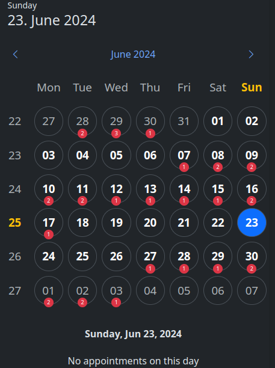
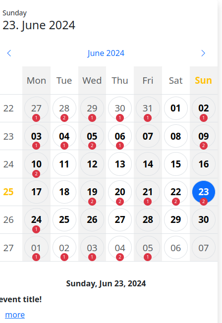
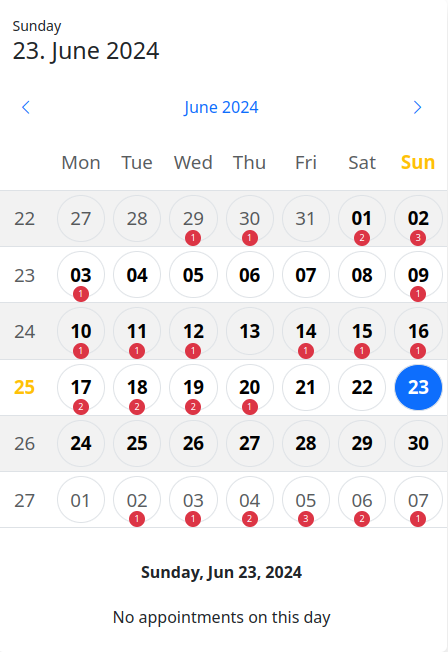
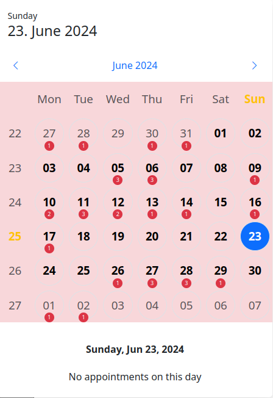
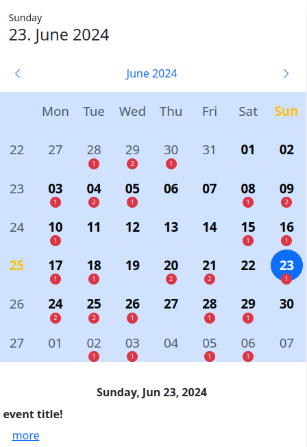
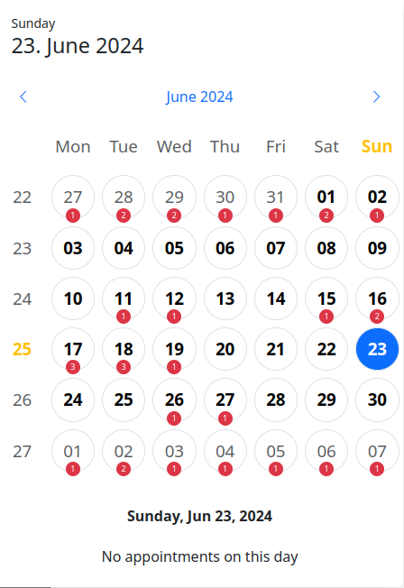

# jquery-bs-calendar


The event calendar was created with JQuery and Boostrap 5. It does not need any additional CSS file.  
The calendar can be included in all Boostrap elements (.card, .navbar, .offcanvas, .dropdowns, ...).

### options

| prop                 | type                          | default           | description                                                                                                                                                                                                           |
|----------------------|-------------------------------|-------------------|-----------------------------------------------------------------------------------------------------------------------------------------------------------------------------------------------------------------------|
| locale               | `string`                      | `'en'`            | Sets the language of days and months                                                                                                                                                                                  |
| url                  | `null`\|`string`\| `function` | `null`            | When a function is implemented, an array of event objects is expected. A string represents the path to the server. If the value remains at `zero`, no appointments will be loaded.                                    |
| queryParams          | `function`                    | see example below | Additional parameters can be sent to the server here. From and To are always sent.                                                                                                                                    |
| width                | `string`                      | `'310px'`         | Sets the width of the container. All subelements are calculated from the width of the container.                                                                                                                      |
| icons                | `object`                      | see example below | Here you can change the icon classes. Bootstrap icons are set as default.                                                                                                                                             |
| showTodayHeader      | `boolean`                     | `true`            | Show or hide the header of the calendar, which contains information about today.                                                                                                                                      |
| eventListContainer   | `null`\|`string`              | `null`            | If a selector is specified here, the appointment list will be transferred to this selector.                                                                                                                           |
| classes              | `object`                      | see example below | Here you can set your own CSS classes for the elements in the calendar to stylishly adapt your container to your page. The calendar is built with a table and can therefore easily inherit the themes from Bootstrap. |
| event                | `object`                      | see example below | The object `event` expects 2 properties. Firstly the function `formatted(event){}` which expects a string as return and secondly the event handler list as object[]                                                   |
| popoverConfig        | `object`\|`null`              | see example below | The popover configuration can be set here, more at https://getbootstrap.com/docs/5.3/components/popovers/#options. If the value is `null`, no popover will be initialized.                                            |
| formatPopoverContent | `function`                    | see example below | The content of the popover can be formatted here. The condition for this is that the showPopover attribute is set to true.                                                                                            |
| formatNoEvent        | `function`                    | see example below | The display when there are no appointments on the selected date.                                                                                                                                                      |

### full options example
```javascript
const options = {
    "locale": "de",
    "url": null,
    "width": "310px",
    "icons": {
        "prev": 'bi bi-chevron-left',
        "next": 'bi bi-chevron-right'
    },
    "showTodayHeader": true,
    "eventListContainer": null,
    "classes": {
        "table": 'table table-sm table-borderless',
        "tableHeaderCell": 'text-muted fw-lighter',
        "tableHeaderCellActive": 'text-warning fw-bold',
        "tableData": {
            "all": 'rounded-circle w-100 h-100 border',
            "today": 'text-bg-primary',
            "hover": 'shadow',
            "active": 'border-secondary',
            "inMonth": 'fw-bold',
            "notInMonth": 'text-muted fw-small',
            "eventCounter": 'start-50 bottom-0 translate-middle-x text-bg-danger rounded-pill'
        }
    },
    "event": {
        formatter(event) {
            return drawEvent(event);
        },
        events: { // a list of events for each event
            "click .edit-button"(e, event, $element) { // example 1
                e.preventDefault();
                console.log('event', event, 'clicked on', $element.get(0));
            },
            "change .some-select"(e, event, $element) { // example 2
                e.preventDefault();
                console.log('event', event, 'select object', $element.get(0));
            },
        }
    },
    "popoverConfig": {
        animation: false,
        html: true,
        delay: 400,
        placement: 'top',
        trigger: 'hover'
    },
    "formatPopoverContent"(events) {
        return '';
    },
    "formatNoEvent"(date) {
        return "No appointments on this day";
    },
    "queryParams"(params) {
        params.userId = 1;
        return params;
    }
}
```

### the event object

The event object must have a start and an end attribute

```json
{
  "id": 1,
  "title": "first date",
  "description": null,
  "start": "2022-10-30 10:00:00",
  "end": "2022-10-30 12:30:00",
  "link": "",
  "whatever": "you want..."
}
```

### set defaults

This function can be used to define default values, such as the language before initialization.

```js
// set single property
$.bsCalendar.setDefault(prop, value);
// or multiple properties
$.bsCalendar.setDefaults({
    prop: value,
    prop2: value2
});
```

### methods

```js
$('#calendar').bsCalendar(method, param);
```

| methodName    | Params                 | Description                                           |
|---------------|------------------------|-------------------------------------------------------|
| refresh       | -                      | Reloads the dates                                     |
| updateOptions | (object) {new:options} | Updates the options of the calendar                   |
| setDate       | (string) '2024-12-24'  | Switches the calendar to the month given in the date. |

### events

```js
$('#calendar')
    .on('eventName', function (e, ...params) {
    });
```

| eventName           | params       | Description                                                    |
|---------------------|--------------|----------------------------------------------------------------|
| init                | -            | Fires when the calendar is fully initialized                   |
| change-day          | date, events | Fires when a date was clicked manually                         |
| events-loaded       | events       | Fires when the data has been loaded from the server            |
| show-event-list     | events       | Fires before building the appointment list                     |
| shown-event-list    | events       | Fires when the appointment list has been created and displayed |
| click-current-month | -            | Fires when the button for the current month is pressed         |
| click-prev-month    | -            | Fires when the button for the previous month is pressed        |
| click-next-month    | -            | Fires when the button for the next month has been pressed      |
| change-month        | -            | Fires when the month is changed                                |

```js
$('#calendar')
    .on('init', function (e) {
    })
    .on('change-day', function (e, date, events) {
    })
    .on('events-loaded', function (e, events) {
    })
    .on('show-event-list', function (e, events) {
    })
    .on('shown-event-list', function (e, events) {
    })
    .on('click-current-month', function (e) {
    })
    .on('click-prev-month', function (e) {
    })
    .on('click-next-month', function (e) {
    })
    .on('change-month', function (e) {
    })
```
### themes examples






